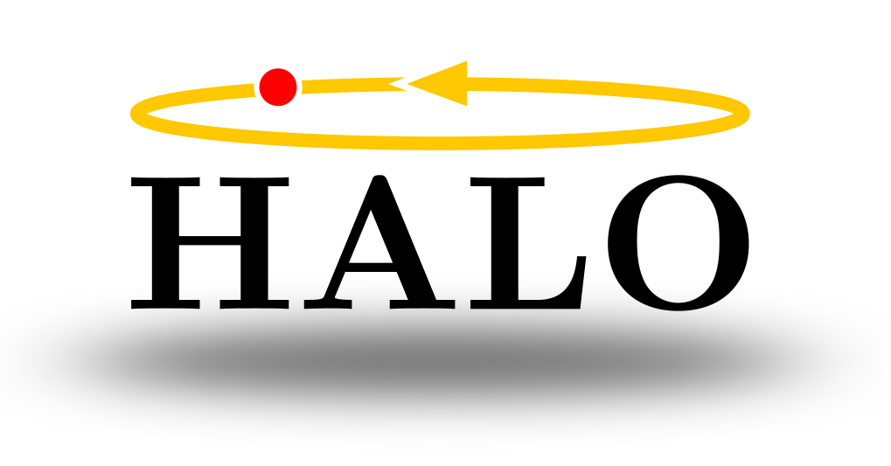

## Hybrid Auto-encoded Locomotion (HALO)

<p align="center">
  
</p>

A framework for learning reduced-order models (ROMs) of legged locomotion dynamics using autoencoders. The pipeline spans RL policy training, GPU-accelerated data generation, Poincare section extraction, autoencoder-based ROM learning, and stability analysis via Lyapunov methods.

## Installation

```bash
conda env create -f environment.yml
conda activate env_rom
```

## Physics Models

MuJoCo XML models in `models/`:

| Model | DOF | Description |
|---|---|---|
| `paddle_ball.xml` | 4 | Paddle hits ball to regulate ball height |
| `hopper.xml` | 4 | Hopping robot with spring-loaded leg |
| `g1_23dof.xml` | 28 | Unitree G1 humanoid robot |

## Pipeline

#### 1. Train RL Policy
```bash
python rl/train_rl.py    # train with Brax PPO
python rl/play_rl.py     # interactive MuJoCo playback
```
See `rl/README.md` for details.

#### 2. Generate Trajectory Data
```bash
python data/mjx/parallel_sim.py    # MJX backend (hopper, paddle_ball)
python data/warp/parallel_sim.py   # Warp backend (g1_23dof)
```

#### 3. Parse Poincare Sections
```bash
python data/mjx/parse_hopper_data.py
python data/warp/parse_g1_23dof_data.py
```
See `data/README.md` for details.

#### 4. Train Autoencoder ROM
```bash
python scripts/train.py
```
Configure system, latent dimension, network sizes, and loss weights at the top of the script.

## Autoencoder Architecture

Three components (`utils/auto_encoder.py`):
- **Encoder** `E(x) -> z`: full-order state to latent
- **Decoder** `D(z) -> x`: latent to reconstructed state
- **Latent dynamics** `z_{t+1} = z_t + f(z_t)`: residual-form discrete map

Training loss:

| Term | Purpose |
|---|---|
| L_x | Reconstruction in state space |
| L_z | Cycle consistency in latent space |
| L_fwd | Forward conjugacy: `E(x_{t+1}) ~ f(E(x_t))` |
| L_bck | Backward conjugacy: `D(f(E(x_t))) ~ x_{t+1}` |
| L_pred | Multi-step rollout prediction |
| L_iso | Isometry: latent covariance toward identity |
| L_reg | L2 weight regularization |

## Tensorboard

```bash
tensorboard --logdir=./scripts/log --port=6006   # AE training
tensorboard --logdir=./rl/log --port=6006        # RL training
```
